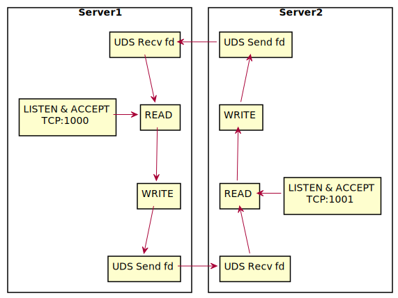

## 【后台技术】进程间传递网络连接(文件描述符)

本文介绍通过实验([代码仓库](https://git.woa.com/jasonzxpan/send_recv_fd_server_client))模拟两个 Server 之间传输网络连接。做个实验的主要背景：

- 进程间传递网络连接可以被用于热重启。之前的文章 《[Envoy网关热重启原理分析](https://km.woa.com/group/34294/articles/show/437024)》中介绍过，但 Envoy 代码较重，比较难以理解相关概念。
- 了解 UDS(Unix Domain Socket) 的使用方法。 APUE 第 17 章有介绍 UDS 及通过 UDS 传递文件描述符的具体做法。

项目使用 Bazel 构建，依赖 libevent 事件引擎库，也用到 apue 示例代码（以库的方式使用）。

## 1. Server

Server 的具体逻辑：

- 创建 socket 监听 TCP 端口
- accept 建立客户端连接
- 从连接上读一个请求（可能一次性发多个逻辑请求）
- 在该连接上发送返回，标识是哪个server
- 将 fd 传递给另外一个server进行后续处理

调用 `sh start_server.sh` 会构建 server 程序，并拉起两个进程，分别监听 1000 和 1001 端口，同时会创建并监听对应端口的一个命名 UDS（**下图中 server1 建立的 fd 被传送到了 server2**）：


接收协议类型，为了能够恰好去切包。针对不能确切的切包的协议，后边会有讨论。

```c++
// 仅为协议描述
struct proto {
char len;
char data[len];
};
```

返回内容为纯文本：

```c++
rsp from port: ${服务监听端口}
```

每个server都会写对应端口的log文件，1000.log 和 1001.log 会接收到相同条数到内容。

两个 server 完全相同，只是监听的端口不同。这里为了简便，所以让他们监听了不同的端口，其实 Linux 允许多个进程监听同一个端口——真是场景中才有意义。




## 2. 一元 RPC Client

调用 `sh start_unary_client.sh` 会构建一元 RPC 请求的 client。

一元 RPC Client 逻辑：

- 并发启动 100 个 client，即建立100连接，每个 client 重复执行以下发送请求和接收返回 1000 次
  - 发送一条请求
  - 等待一条返回
  - 继续发送下一条请求
  - 继续等待下一条请求


【校验内容】校验每个 Client 的每次获得的返回与前一次返回来自于不同的处理进程：

```c++
assert((port ^ client->last_server_port) == 1);
client->last_server_port = port;
```

【屏幕输出】让一个 Client 打印每次处理服务的进程端口信息：

```c++
if (client->index == 0) {
  printf("port: %d, last_port: %d\n", port, client->last_server_port);
}
```

可以直观的看到每个消息处理完都有发生连接的传送：


## 3. 流 RPC Client

使用流 Client 测试是为了验证当操作系统已经接收到完整消息之后，即内容在内核缓存时，是否能够正常的进行连接传递。

调用 `sh start_stream_client.sh` 会构建流 RPC 请求的 client。其处理逻辑是：

- 一次性发送1000条请求
- 等待所有返回，直到 EAGAIN 之后 5 秒超时，关闭连接
- 校验接收数据

【校验内容】校验总返回条数为1000，且每次返回来源于两个不同的server且严格交替：

```c++
while (pos != std::string::npos) {
  port = get_current_port(); // 省略处理过程
  assert((port ^ last_port) == 1);
  last_port = port;
}
assert(counter == kRepeateTime);
```

## 4. 其他思考

1. 两个 server 其实可以监听相同的 tcp 端口
2. 无法恰好切好的协议，可以在传递 fd 的同时，将已经读出来的内容同时通过 UDS 发送给另外的 server